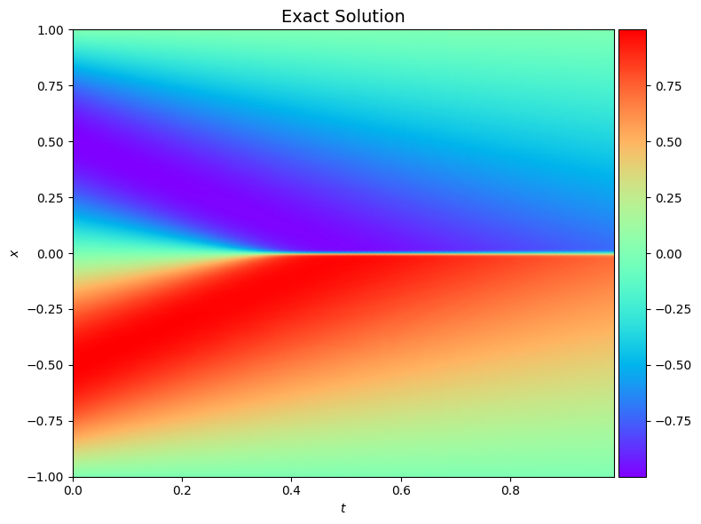
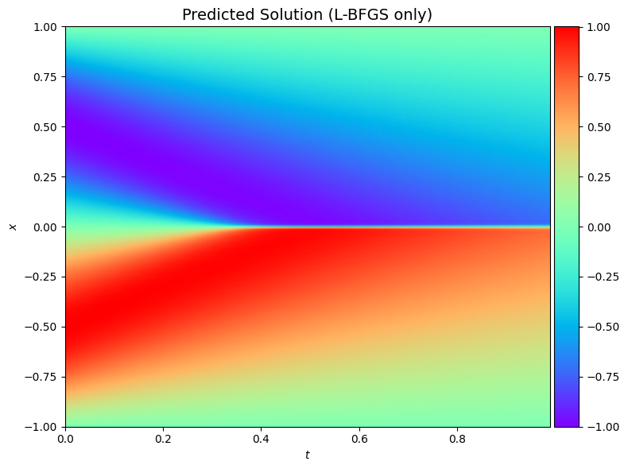
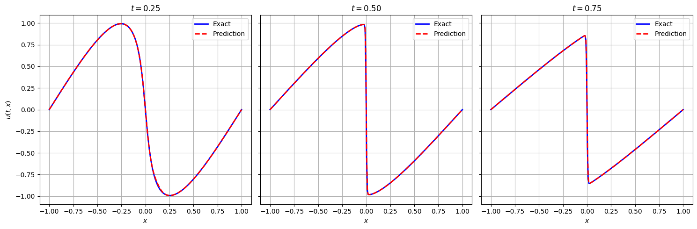
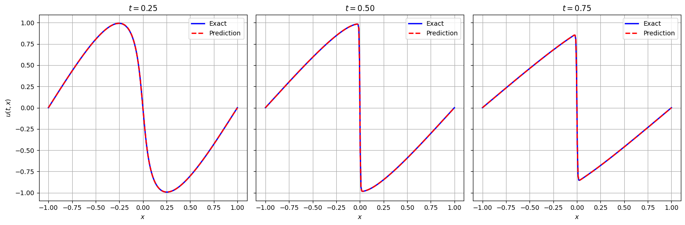

# Physics-Informed Neural Networks for Burgers' Equation (PyTorch)

[](https://github.com/harshu0117)
[](https://pytorch.org/)


This repository provides a modern **PyTorch** implementation of Physics-Informed Neural Networks (PINNs) to solve both forward and inverse problems for the 1D Burgers' equation. It serves as a practical, hands-on guide to understanding and applying PINNs, demonstrating their power in modeling physical systems and discovering underlying parameters from data.

The primary goal of this project is to replicate the results of the original paper by Raissi et al. while translating the codebase from its original **TensorFlow 1.x** to the more modern and widely-used **PyTorch** framework. This provides an updated and more accessible version for researchers and practitioners familiar with the PyTorch ecosystem.

This repository contains the code and experiments for solving both the **forward and inverse problems** of the 1D Burgers' equation using Physics-Informed Neural Networks (PINNs). The implementation is based on the original paper by Raissi, Perdikaris, and Karniadakis, "[Physics-informed neural networks: A deep learning framework for solving forward and inverse problems involving nonlinear partial differential equations](https://arxiv.org/abs/1711.10561)".

The notebooks demonstrate how a neural network can be trained to respect the laws of physics defined by a partial differential equation (PDE), enabling it to solve for the system's state or even discover the PDE's underlying parameters from data.
---

## 🎯 Project Structure

* **`forward_continuous.ipynb`**: A Jupyter notebook that solves the **forward problem**. Given the initial and boundary conditions, it predicts the solution `u(x, t)`. It also compares two optimization strategies: L-BFGS only and a hybrid Adam + L-BFGS approach.
* **`inverse_continuous.ipynb`**: A Jupyter notebook that solves the **inverse problem**. Given a sparse and noisy set of measurement data for `u(x, t)`, it discovers the unknown parameters of the Burgers' equation.
* **`src/`**: A directory containing the core Python modules for the PINN model (`PhysicsInformedNN.py`), the training logic (`trainer.py`), data handling (`utilities.py`), and plotting functions (`visualisation.py`).
* **`data/`**: Contains the reference solution data (`burgers_shock.mat`).
* **`equations/1D_Burgers/`**: Contains the notebooks and the generated result images.

---

## 🚀 Getting Started

### Prerequisites

* Python 3.7+
* PyTorch
* NumPy
* SciPy
* Matplotlib
* PyDOE

### Installation

1.  **Clone the repository:**
    ```bash
    git clone [https://github.com/harshu0117/Physics-Informed-Neural-Nets.git](https://github.com/harshu0117/Physics-Informed-Neural-Nets.git)
    cd Physics-Informed-Neural-Nets
    ```

2.  **Install the required packages:**
    ```bash
    pip install torch numpy scipy matplotlib pyDOE
    ```

3.  **Run the notebooks:**
    Launch Jupyter Notebook or JupyterLab and open the `.ipynb` files to run the experiments.
    ```bash
    jupyter notebook
    ```

---

## 🔬 Experiments and Results

### 1. The Forward Problem

**Goal:** To predict the solution `u(x, t)` of the Burgers' equation given known initial and boundary conditions.

**Key Findings:**
The L-BFGS-only method achieved a final relative L2 error of **`6.13e-3`**. The hybrid Adam + L-BFGS method showed some training instability, resulting in a slightly higher error of **`9.01e-3`**. This highlights the sensitivity of the training process to the optimization strategy.

#### **Visual Results (Forward Problem)**

<table>
  <tr>
    <td align="center"><strong>Ground Truth</strong></td>
    <td align="center"><strong>Prediction (L-BFGS)</strong></td>
    <td align="center"><strong>Prediction (Hybrid)</strong></td>
  </tr>
  <tr>
    <td></td>
    <td></td>
    <td></td>
  </tr>
</table>

**Predicted Solution (Forward Problem)**
<p align="center">
  
</p>


### 2. The Inverse Problem

**Goal:** To discover the unknown parameters ($\lambda_1, \lambda_2$) of the Burgers' equation using only a sparse set of 2,000 noisy data points.

**Key Findings:**
The model successfully identified the hidden parameters with remarkable accuracy, demonstrating its robustness to noise. The final learned PDE is very close to the true physical law.

#### **Parameter Identification Results (Inverse Problem)**

| Parameter | True Value | Predicted Value | Error |
| :--- | :--- | :--- | :--- |
| $\lambda_1$ (convection) | `1.0` | `0.9985` | `0.15%` |
| $\lambda_2$ (viscosity) | `0.003183` | `0.003177` | `0.21%` |

The overall solution accuracy was also high, with a final **relative L2 error of `1.89e-3`**.

#### **Visual Results (Inverse Problem)**

**Predicted Solution (Inverse Problem)**
<p align="center">
  
</p>

*Caption: Despite training on noisy, sparse data, the PINN reconstructed the full solution field with high fidelity.*

---

## Acknowledgments

This work is an implementation based on the concepts introduced in the seminal paper:

> M. Raissi, P. Perdikaris, G. E. Karniadakis. "Physics-informed neural networks: A deep learning framework for solving forward and inverse problems involving nonlinear partial differential equations". Journal of Computational Physics, Vol. 378, pp. 686-707, 2019.
